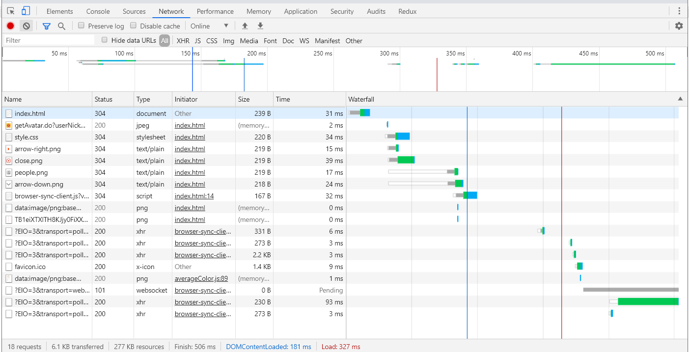
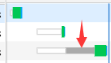
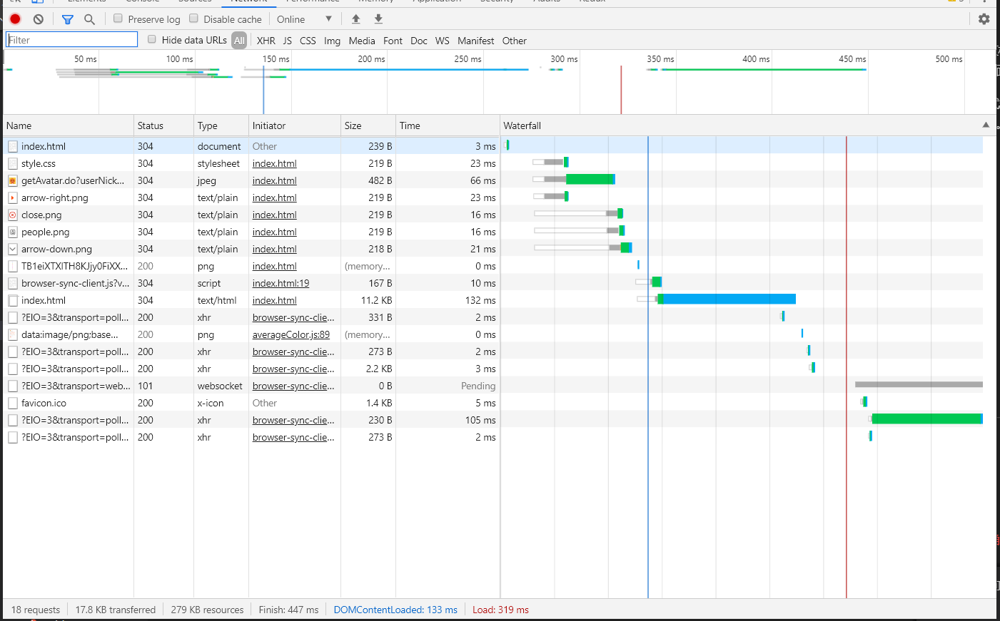

# 实验4

## 软工181_2017210904069_严启铭

### 1.Chrome Devtools network 功能分析页面加载  

先把在没有进行优化调整时页面所加载的Network的图片放上来。
***
 

这张图片还是可以比较去清晰的看到整个页面加载的过程。  
下面会拆分说明其一些基本的内容:  

1. 每个资源的timeline:  
在右边的WaterFall中可以很清楚的看到每个元素加载的时间顺序,拿一些主要的资源来讲跟上课时讲到的一样是先加载html文本,将HTML标记转换成文档对象模型 DOM,也就是将一堆HTML字节转换成DOM树。  

    在处理完DOM树之后就开始对CSS进行处理,将CSS标记并构建CSSOM树。再然后就是将DOM与CSSOM合并成一个渲染树并根据渲染树来布局，以计算每个节点的几何信息,最后将各个节点绘制到屏幕上。  

    我们也能清楚的观察到,如下图:  

    (不知道为什么align=center不生效,好迷,凑合着看)

    第一行是加载HTML,之后是加载CSS,在CSS加载后有一段灰色的时间为**Stalled**,不知道说的对不对,但我想这段时间也能够给就是DOM和CSSOM合并并计算布局的那段时间,在这段时间过后加载了这张png并渲染到了屏幕上。  
    
    这一阶段就大概阐述到这里。

2. DOMContentLoaded 的值:
   
   DOMContentLoaded事件:页面文档完全加载并解析完毕之后会触发。
   DOMContentLoaded在图上和下面的数据可以看到是在181ms的时刻触发。

3. 蓝色线和红色线的值:
   蓝色线就代表了DOMContentLoaded事件,而红色线代表了Load事件也说明了页面加载完毕。分别是181ms和327ms。 

### 2.修改JS和CSS代码,说明是否优化
下面放上优化后的Network图。

 

 可以明显的看到无论是DOMContentLoaded还是Load的触发时间有了明显的减少。Load减少的不明显我认为是下面的原因造成的。最为重中之重的原因就是由于DOMContentLoaded完成后外部图片的加载,图片的加载有很多的原因有可能是自身的网络的波动也有可能与外部服务器的响应速度,并发量有关,从而影响了服务器的性能,导致图片加载时间的波动,这些都是有可能的。