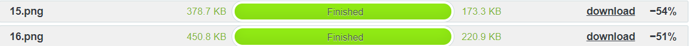
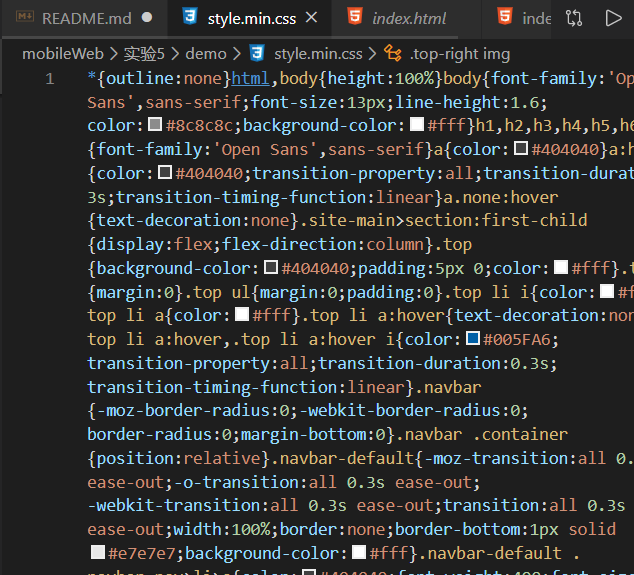
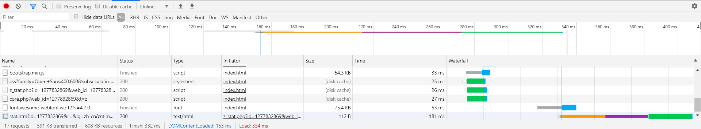
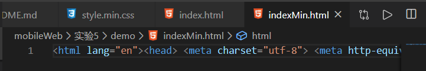
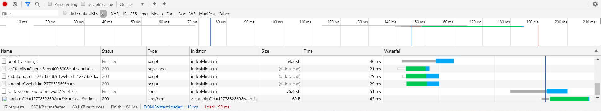
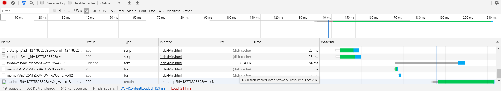
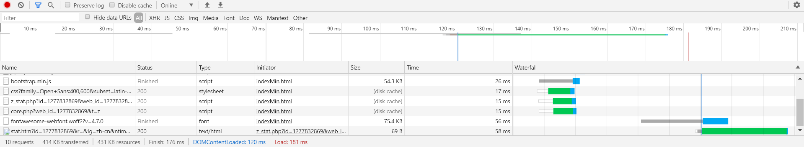

# 2017210904069_严启铭

## 1.图片压缩对比

通过jpg压缩后

通过png压缩后

结果看来是相同的..

## 2.某公司页面压缩优化

在压缩以前先来看看最先开始未经压缩的效果

应该可以很清楚的看到**DOMContentLoaded**数值为201ms,而**Load**数值为 374 ms  

---
下面我们来看看文字压缩后的

首先是只对css进行压缩后的,下图是我对style.css进行的压缩  

现在我们把这个css引入并查看一下结果

应该可以很清楚的看到**DOMContentLoaded**数值为153ms,而**Load**数值为 334 ms ,性能有了明显的提升。  

下面再将HTML进行压缩。

这是我对HTML进行的压缩

下面打开浏览器查看一下

应该可以很清楚的看到**DOMContentLoaded**数值为145ms,而**Load**数值为 190 ms ,load速度和最初相比将近节省了一半的时间,速度得到了大幅度的提升。

速度提升的原因就是字符的减小吧,文件大小也明显的下降。

---

下面进行http请求的优化  

首先先做的就是**合并文字资源，减少下载频率**  

应该可以很清楚的看到**DOMContentLoaded**数值为139ms,而**Load**数值为 211 ms ,减少了发出的HTTP请求的数量,又快了一些。

接下来就是**图片合并**将图片制作为精灵图。效果如下图:

再通过css修改

应该可以很清楚的看到**DOMContentLoaded**数值为135ms,而**Load**数值为 184 ms ,明显的又快了些

速度提升的原因就是请求数量的减小,请求数量的减少,大大缩短了时间,上次实验报告中也有提到,文件资源下载的过程中很多时间都是Stalled等待时间,减少请求次数等待时间也大大的缩短了很多。

---

最后是压缩图片资源把所有用到的图片像(1.压缩图片对比)中的方式进行压缩,这里就不再一张一张放截图了,md好麻烦啊我这里保存了一大串截图了...

话不多说放结果

应该可以很清楚的看到**DOMContentLoaded**数值为120ms,而**Load**数值为 181 ms ,明显的又快了些

这次的时间的减少原因很明显是因为,图片资源大小的减少,从而加快了加载的速度。

Over。