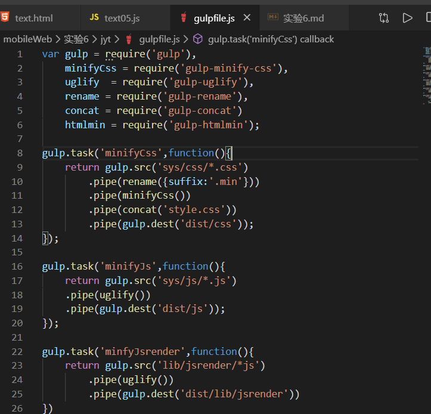
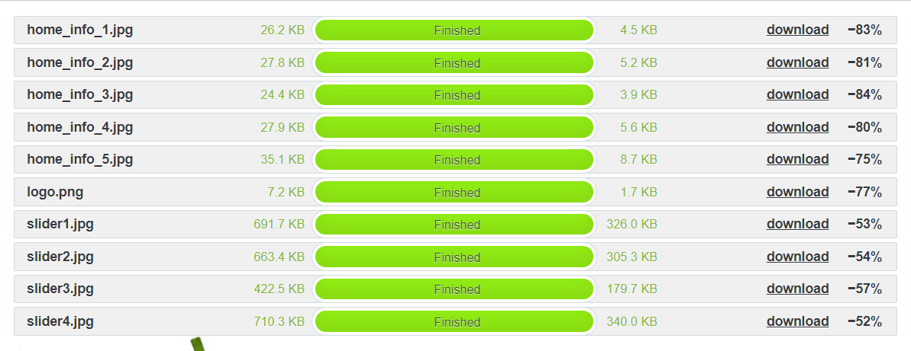
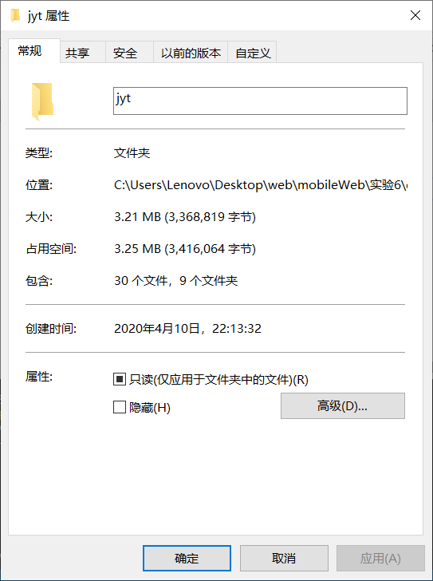
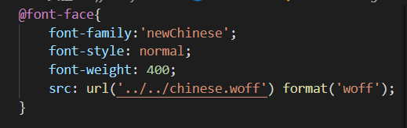
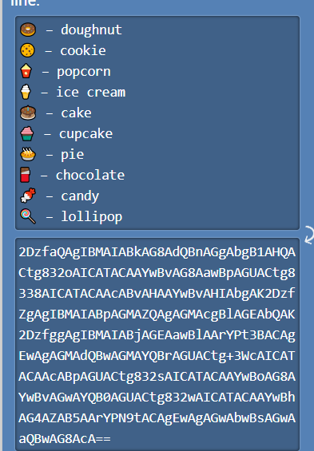

# 2017210904069_严启铭_实验6

## 1. 使用 gulp 编写资源压缩程序

在项目工程目录下面执行下面的一些代码  
首先初始化整个项目
```
yarn init
```
初始化完成后项目目录中会生成出**package.json**这个文件  
接下来对gulp进行安装
```
yarn gloabl add gulp-cli

yarn add gulp
```
以及一些gulp插件的安装
```
//这是一些自己使用到的插件
yarn add gulp-minify-css gulp-uglify gulp-rename gulp-concat gulp-htmlmin gulp-imagemin
```
之后安装官网教程说的那样子在项目**根目录**来编写**gulpfile.js**文件。这里就展示个大概吧。



编写完成后执行一下,下面的指令(可选)
```
gulp --tasks
```
看看自己大半天到底忙了个啥东西出来。


写好了后面执行一下就好了
```
gulp minifyCss
gulp minifyJs
gulp minfyJsrender 
...
/**
 * 后面的都是一些重复性的东西了
 */
```
对于图片压缩并没有选择用gulp进行压缩,而是依旧选择了那个可爱的小熊猫去压缩



下面来看看效果如何吧,下面是压缩前的整个文件,可以看到有**3.21M**的大小



把一些未被压缩的文件原封不动的放进来,下面看看压缩后的


WOW可以看到小了一半

---

## 2. 替换标题和菜单的字体

在网上随便找了一个中文字体把它下载了下来


使用nodejs字体转换程序进行转换,安装一下


然后使用其将字体文件进行转换,看到社区里面说一些中文字体转换后可能会有问题  
我这个这么老而且low的字体应该没事吧(但愿没事)

执行程序


生成成功


修改css



看下效果


---
## 3.找些有意思的东西

Unicode base64编码器我认为很有意思,因为平时后端在进行存储时经常会用到base64的相关转换。文件图片等等都可以转换为base64编码进行相关存储

